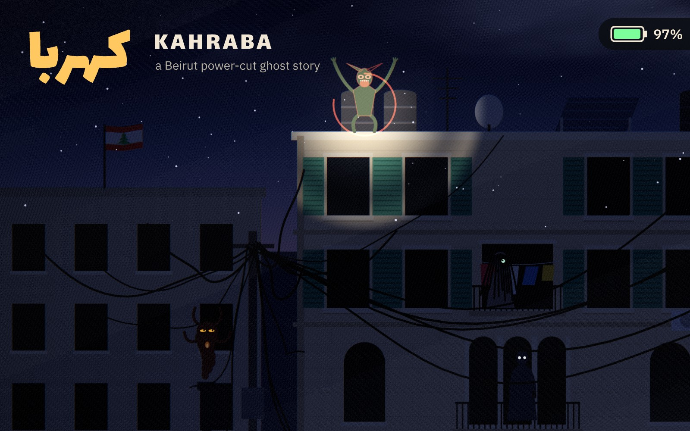
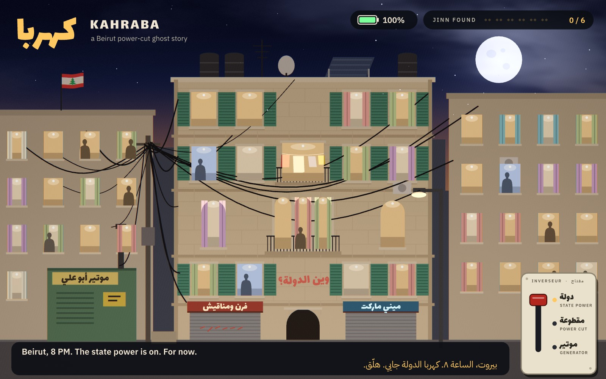
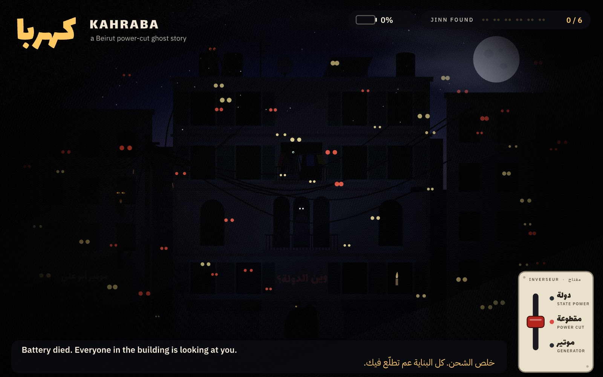
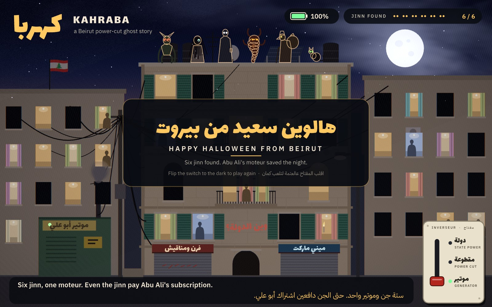

# كهربا · Kahraba

**A Beirut power-cut ghost story, built with Rive.** Entry for the Contra × Rive Halloween Challenge 2026.
Video, stills and notes: https://taktek.io/kahraba/



It is 8 PM in Beirut and the state power (*kahraba el dawleh*) is on. For now. The lights stutter, the way
every Beiruti knows they will, and then the building goes dark. Six jinn live here, and in the cut you can see
their eyes in the windows. Your phone light is the pointer: rest it on a pair of eyes and the jinn behind them
shows itself, reacts, and flees.

* **The Ghoul** crouches between the water tanks; lit, it rears up and throws its claws over its head.
* **The Si'lewa** combs her hair behind Umm Georges' laundry; lit, her hair whips and she ducks behind the sheets.
* **The Qarina**, your shadow twin, steps the other way when you move, and lifts her own phone at you.
* **The Ifrit**, born in generator smoke, swells and burns, then gets sucked back down the chimney.
* **Abu Kees**, in his tarboush, has a sack on his back; lit, something inside it starts kicking.
* **The neighbours' cat** arches and puffs its tail. Probably just a cat.

Find all six and Abu Ali's neighbourhood generator (*el moteur*, 5 amps) coughs into life, the subscribers'
windows come back, and the six jinn sit on the parapet together. Even the jinn pay the subscription. Keep the
light on too long and the battery dies, and every window in the building opens its eyes. The inverter switch
(*inverseur*: state power / cut / moteur) works the whole time; flip it yourself.

Captions are in English and Lebanese Arabic.





Video: [media/kahraba.mp4](media/kahraba.mp4)

## Rive features used

| Feature | Where |
|---|---|
| **Rive CLI** | the whole file is built, verified, screenshotted and frame-rendered headless with `rive` 1.5 |
| **RML** | `scene.rml` (generated by `tools/gen_scene.py`): text, HUD, cards, the switch, the state machine, every keyed animation |
| **Scripting (Luau)** | `main.luau`: a `ScriptedLayout` that draws the street twice a frame (albedo and emission), runs the story clock, the torch, the six jinn and their reactions, sparks, smoke and the generator's rumble |
| **GPU Canvas (WGSL)** | `light.wgsl`: one full-screen pass lights the street: city glow vs moonlight, window spill, the phone torch, a painted sky with clouds, bloom, ground fog, shake and grain |
| **Data binding** | a `Street` view model: `power`, `phase`, `found`, battery, captions (EN/AR), card text, street-light level. Text runs, the battery bar width, and the neon signs' opacity are bound through range-mapper converters |
| **State machine** | four layers: *Lever* (the switch, with an overshooting throw and the plate knocking the wall), *Story* (intro / hunt / rescued / ending), *Cards* (one state per jinn found), *Battery* (calm, or red and breathing below 20%) |

Hand-tuned in the markup (tuned by eye, frame by frame against screenshots; an Editor pass on top follows): named ease curves (`SNAP_OUT`, `SLOW_IN`, `SETTLE`, `THROW` in `tools/gen_scene.py`),
the lever's 240 ms overshoot, the 3-frame plate knock, the card's elastic slide and 2.5 s hold, the end card
waiting 190 frames for the parade. In the script: the story timing (`CUT_AFTER`, `WARN_AT`, `DWELL`), the
hand-placed torch path the demo follows, each jinn's pose and its own hand-picked palette
(ash, bone, shadow, ember, sackcloth, black cat), and the warm rim that lights the six on the parapet.

## Build and run

Needs the Rive CLI (`curl -fsSL https://releases.rive.app/cli/install.sh | bash`, then `~/.rive/bin` on `PATH`).

```bash
python3 tools/gen_scene.py          # regenerate scene.rml from the layout script
rive . --verify                     # compile RML + Luau + WGSL, 0 errors expected
rive .                              # open the live previewer and play
rive . --screenshot=build/x.png --data=autoplay=1 --advance=1110   # a frame of the demo path, headless
```

`--data=autoplay=1` makes the torch follow the scripted demo path instead of the pointer.
`--data=quality=1.25 --viewport=1600x1000 --fit=contain` renders sharper stills.

To publish a playable web page (needs a Rive login, which signs the scripts):

```bash
rive login
rive . --publish=web --name=kahraba
```

### The video and stills (one command)

The CLI captures one frame per run, and the scene is deterministic (fixed 60 fps steps, hashed randomness),
so the video is an image sequence of fresh headless runs, each advanced to its own time, cut together with
ffmpeg over a soundtrack synthesised in numpy (nothing sampled). The stills are frames of the same sequences.

```bash
FRESH=1 tools/build_media.sh     # after any change to the scene: re-render every frame
tools/build_media.sh             # resume / re-cut only (cached frames in /tmp/kframes are reused)
```

That runs `rive . --verify`, then `tools/render_frames.py` (7 parallel workers, each in its own copy of the
project; resumable), `tools/make_sound.py`, `tools/make_video.py` and `tools/make_stills.py`, and writes
`media/kahraba.mp4` plus the five JPEGs (`tools/make_hero.sh` renders the cover separately, zoomed in on the roof). Needs Python 3 with Pillow + pygments, a Python with numpy for the
sound (`PY_SND`, default `~/venvs/pw/bin/python`), and ffmpeg. About an hour of frames plus 20 min of cutting on a loaded 12-core laptop.
Headless Linux tip: if `rive --screenshot` says `eglInitialize failed (no display server)`, run it with
`EGL_PLATFORM=surfaceless` (the render script does this already).

Timeline of the film (seconds): 0 title, 3.2 how it's made (RML, Luau, WGSL, the CLI loop), 22.6 the piece
(cut at 29.6, six catches, the moteur ending), 63.1 the battery-dies ending, 69.1 credits, 73.7 end.

### The page

`site/` plus `media/` is the `gh-pages` branch (served at https://taktek.io/kahraba/):

```bash
git worktree add /tmp/kahraba-pages gh-pages && cp -r site/. media /tmp/kahraba-pages/ \
  && git -C /tmp/kahraba-pages commit -am "Update page" && git -C /tmp/kahraba-pages push
```

## Credits

* Concept, story, art direction and code: [Taktek](https://github.com/taktekhq), Beirut.
* Fonts: [Lalezar](https://github.com/BornaIz/Lalezar) by Borna Izadpanah and
  [IBM Plex Sans Arabic](https://github.com/IBM/plex) by IBM, both under the SIL Open Font License 1.1
  (`licenses/`).
* Built with [Rive](https://rive.app) and the Rive CLI.

Code and art: MIT (`LICENSE`). The fonts are not covered by it; they are under the SIL OFL 1.1 (`licenses/`).
